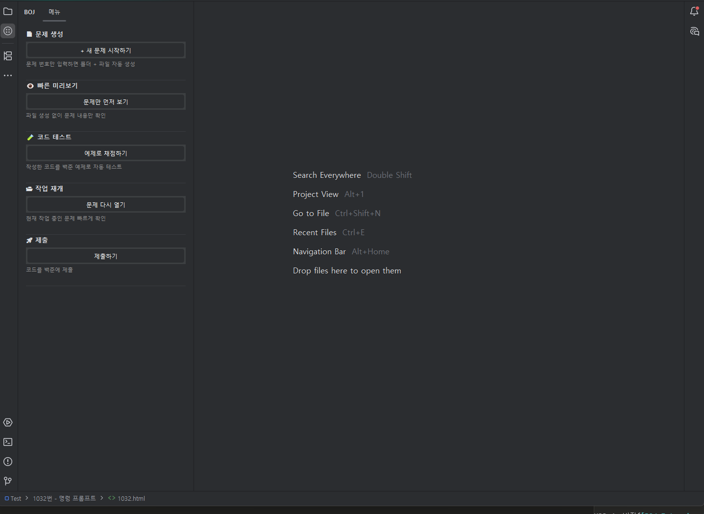

# BOJ Assistant for JetBrains

<!-- Plugin description -->
BOJ Assistant for JetBrains는

> IntelliJ IDEA / PyCharm 내부에서 백준 문제 생성, 테스트, 제출을 자동화하여  
> 알고리즘 학습 생산성을 극대화하는 플러그인입니다.

## ✨ Core Features

| 기능             | 설명                                      |
| ---------------- | ----------------------------------------- |
| 문제 자동 생성   | 번호 입력 시 폴더 + 템플릿 자동 생성      |
| 빠른 미리보기    | 파일 생성 없이 문제 내용만 빠르게 확인    |
| 테스트 자동 실행 | 예제 케이스 자동 채점 및 결과 출력        |
| 작업 재개        | 현재 작업 중인 문제 빠르게 다시 열기      |
| 제출             | 코드 복사 + 제출 페이지 열기 |

## 🛠 Supported Languages

| Language | Runtime              | IDE          |
| -------- | -------------------- | ------------ |
| Java     | JDK 필요             | IntelliJ IDEA |
| Python   | Python 인터프리터 필요 | PyCharm      |

<!-- Plugin description end -->

---

## 📌 Motivation

백준 문제를 풀 때마다

- 폴더 생성
- 템플릿 작성
- 테스트 코드 복사
- 입력 리다이렉션 설정

이 반복 작업이 비효율적이라고 느꼈습니다.

그래서 JetBrains IDE 내부에서  
문제 생성 → 테스트 → 제출까지  
한 번에 처리할 수 있는 플러그인을 직접 설계했습니다.

VSCode 버전([BOJ Extension for VSCode](https://marketplace.visualstudio.com/items?itemName=Dong.boj-extension-for-vscode))의 JetBrains 포팅 버전입니다.

---
## 🏗 Architecture

- IntelliJ Platform SDK 기반 플러그인
- Jsoup을 이용한 백준 문제 크롤링 및 파싱
- JCEF를 이용한 문제 HTML 뷰어
- ProcessBuilder 기반 로컬 테스트 실행 및 자동 채점

---

## 🖼️ Preview

> 설치 후 사이드바에서 BOJ Assistant를 실행하면 아래와 같은 GUI가 나타납니다.

  

---

## 🚀 사용법

1. 왼쪽 사이드바에서 **BOJ** 아이콘을 클릭합니다.
2. 사이드바에서 원하는 기능 버튼을 클릭합니다.

---

## 📌 Commands

| Command                   | Description                               | Output              |
| ------------------------- | ----------------------------------------- | ------------------- |
| 🗂 새 문제 시작하기       | 문제 번호 입력 → 폴더 + 템플릿 자동 생성  | 개발 환경 자동 세팅 |
| 👀 문제만 먼저 보기       | 파일 생성 없이 문제 미리보기              | 문제 설명 표시      |
| 🔄 문제 다시 열기         | 현재 작업 중인 문제 다시 열기             | 문제 설명 표시      |
| 🧪 예제로 채점하기        | 예제 테스트 자동 실행                     | 자동 채점 결과      |
| 📤 제출하기               | 주석 제거 후 코드 복사 + 제출 페이지 열기 | 백준 제출 페이지    |

---

### 피드백 및 버그 리포트

버그 리포트나 피드백은 [GitHub Issues](https://github.com/kimdongwoo0930/BOJ-Plugin-for-JetBrains/issues)에서 제출해 주세요.